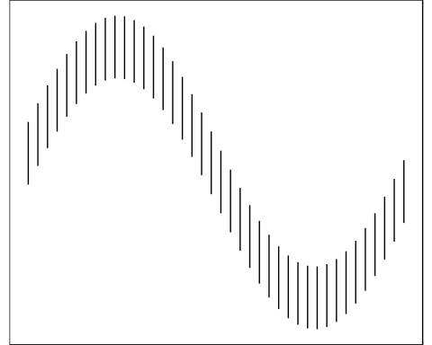

```{r setup, echo=FALSE, include=FALSE}
rm(list=ls())
options(replace.assign=TRUE,width=70,scipen=3)
require(knitr)
opts_chunk$set(fig.path='figure/fig-', cache.path='cache/', fig.align='center', fig.width=5, fig.height=5, fig.show='hold', par=TRUE, cache=TRUE, concordance=TRUE, autodep=TRUE)
library(reshape2)
suppressMessages(library(ggplot2))
library(plyr)
suppressMessages(library(gridExtra))

source("./Revision2/code/functions.r")

```

```{r origillusion, fig.width=5, fig.height=4, out.width='50%', echo=FALSE, include=FALSE}
f <- function(x) 2*sin(x)
fprime <- function(x) 2*cos(x)
f2prime <- function(x) -2*sin(x)

qplot(x=x, xend=xend, y = ystart, yend=yend, geom="segment", data=createSine(40, 1, f=f, fprime=fprime, f2prime)) +
  theme(panel.grid.major=element_blank(), panel.background = element_rect(fill = "white", 
                colour = "black"), plot.margin = unit(c(0,0,-0.5,-0.5), "cm"), 
       panel.grid.minor=element_blank(), panel.background=element_blank(),
       axis.title = element_blank(), axis.ticks = element_blank(), 
       axis.text = element_blank()) + coord_equal(ratio=1)
```

<div align='center'></div>

This repository contains the files and writeup for an experiment conducted in Summer 2013 to measure the strength of the Sine Illusion and the correction necessary to alleviate its' effects. 

## Repository Structure

The final revision of the paper is located in the ./Revision2 subdirectory. The original version is contained in the ./OriginalSubmission/ folder, and ./Revision1 contains the first revision of the paper after comments from reviewers. 